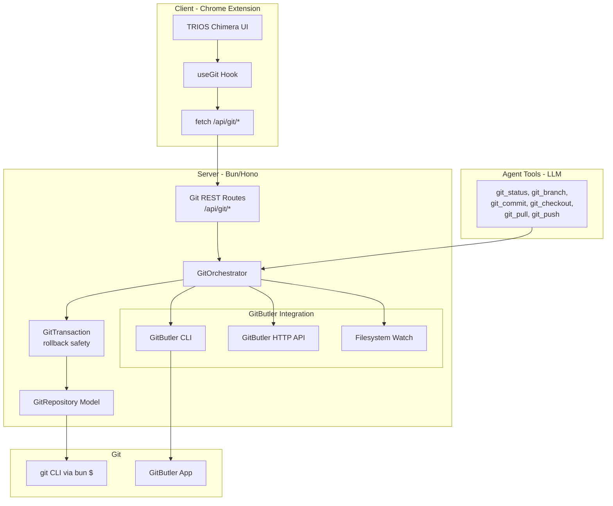
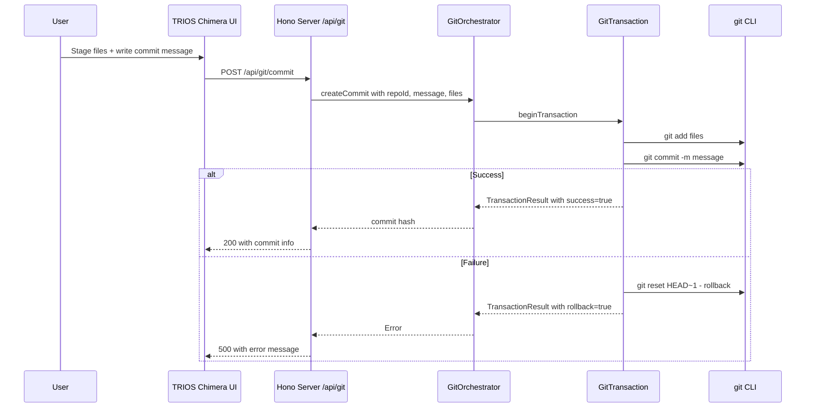
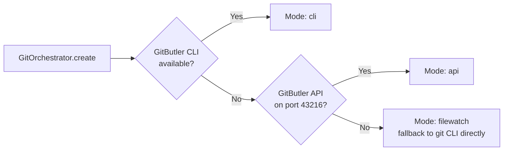

# TRIOS Chimera — Git Integration Architecture Plan

**Issue**: [#496](https://github.com/gHashTag/t27/issues/496)
**Spec**: [`specs/trios/trios_chimera.tri`](packages/browseros-agent/specs/trios/trios_chimera.tri)
**Status**: Scaffolding committed, needs wiring and testing

---

## Current State (What's Already Built)

### Server-side (Bun/Hono)
| Layer | File | Lines | Status |
|-------|------|-------|--------|
| **Orchestrator** | [`git-orchestrator.ts`](packages/browseros-agent/apps/server/src/services/git/git-orchestrator.ts) | 340 | ✅ Full implementation |
| **Repository Model** | [`git-repository.ts`](packages/browseros-agent/apps/server/src/services/git/git-repository.ts) | — | ✅ Types + model |
| **Transaction Safety** | [`git-transaction.ts`](packages/browseros-agent/apps/server/src/services/git/git-transaction.ts) | — | ✅ Rollback mechanism |
| **GitButler CLI** | [`gitbutler-cli.ts`](packages/browseros-agent/apps/server/src/services/git/gitbutler/gitbutler-cli.ts) | — | ✅ CLI integration |
| **GitButler API** | [`gitbutler-api.ts`](packages/browseros-agent/apps/server/src/services/git/gitbutler/gitbutler-api.ts) | — | ✅ HTTP API client |
| **GitButler FS** | [`gitbutler-fs.ts`](packages/browseros-agent/apps/server/src/services/git/gitbutler/gitbutler-fs.ts) | — | ✅ Filesystem fallback |
| **GitButler Index** | [`gitbutler/index.ts`](packages/browseros-agent/apps/server/src/services/git/gitbutler/index.ts) | — | ✅ Mode detection + factory |
| **REST Routes** | [`routes/git.ts`](packages/browseros-agent/apps/server/src/api/routes/git.ts) | 178 | ✅ Full CRUD API |
| **Server Wiring** | [`server.ts:211-215`](packages/browseros-agent/apps/server/src/api/server.ts:211) | — | ✅ Mounted at `/api/git` |

### Agent Tools (LLM-callable)
| Tool | File | Status |
|------|------|--------|
| `git_status` | [`git-status.ts`](packages/browseros-agent/apps/server/src/tools/git/git-status.ts) | ✅ Registered |
| `git_branch` | [`git-branch.ts`](packages/browseros-agent/apps/server/src/tools/git/git-branch.ts) | ✅ Registered |
| `git_checkout` | [`git-checkout.ts`](packages/browseros-agent/apps/server/src/tools/git/git-checkout.ts) | ✅ Registered |
| `git_commit` | [`git-commit.ts`](packages/browseros-agent/apps/server/src/tools/git/git-commit.ts) | ✅ Registered |
| `git_pull` | [`git-pull.ts`](packages/browseros-agent/apps/server/src/tools/git/git-pull.ts) | ✅ Registered |
| `git_push` | [`git-push.ts`](packages/browseros-agent/apps/server/src/tools/git/git-push.ts) | ✅ Registered |

### Client-side UI (React/WXT)
| Component | File | Status |
|-----------|------|--------|
| **Terminal Page** | [`AgentTerminalPage.tsx`](packages/browseros-agent/apps/agent/entrypoints/app/trios-chimera/AgentTerminalPage.tsx) | ⚠️ Scaffolding, lint errors |
| **Branch Selector** | [`GitBranchSelector.tsx`](packages/browseros-agent/apps/agent/entrypoints/app/trios-chimera/GitBranchSelector.tsx) | ⚠️ Scaffolding, lint errors |
| **Commit Dialog** | [`GitCommitDialog.tsx`](packages/browseros-agent/apps/agent/entrypoints/app/trios-chimera/GitCommitDialog.tsx) | ⚠️ Scaffolding, lint errors |
| **File Tree** | [`GitFileTree.tsx`](packages/browseros-agent/apps/agent/entrypoints/app/trios-chimera/GitFileTree.tsx) | ⚠️ Scaffolding, lint errors |
| **Repository Panel** | [`GitRepositoryPanel.tsx`](packages/browseros-agent/apps/agent/entrypoints/app/trios-chimera/GitRepositoryPanel.tsx) | ⚠️ Scaffolding, lint errors |
| **useGit Hook** | [`useGit.ts`](packages/browseros-agent/apps/agent/entrypoints/app/trios-chimera/useGit.ts) | ⚠️ Scaffolding |
| **Types** | [`git-types.ts`](packages/browseros-agent/apps/agent/entrypoints/app/trios-chimera/git-types.ts) | ✅ Type definitions |

### Shared
| File | Status |
|------|--------|
| [`constants/git.ts`](packages/browseros-agent/packages/shared/src/constants/git.ts) | ✅ Git constants |

---

## Architecture Diagram

---

## Data Flow

---

## GitButler Fallback Chain

---

## Implementation Plan

### Phase 1: Fix and Verify Server-side
1. **Fix lint errors** in trios-chimera components (42 errors, 22 warnings from biome)
2. **Verify `GitOrchestrator.create()`** works with real git repos
3. **Test REST API** endpoints via curl:
   - `GET /api/git/repositories` — list repos
   - `GET /api/git/status/:repoId` — get status
   - `POST /api/git/branch/switch` — switch branch
   - `POST /api/git/commit` — create commit
   - `POST /api/git/pull` — pull changes
   - `POST /api/git/push` — push changes
4. **Test transaction rollback** — force a failure mid-transaction, verify rollback

### Phase 2: Wire UI into Extension
5. **Create WXT entrypoint** for trios-chimera tab/page in the agent extension
6. **Connect `useGit` hook** to the `/api/git/*` endpoints
7. **Add navigation** to AgentTerminalPage from the sidepanel

### Phase 3: Agent Tool Integration
8. **Verify git tools** are accessible to the LLM agent via `registry.ts`
9. **Test agent can perform git operations** through tool calls
10. **Add tool descriptions** for the LLM to understand git capabilities

### Phase 4: Testing and Benchmarks
11. **Unit tests** for repository lifecycle, transaction safety, branch switching
12. **Integration tests** for the full commit workflow
13. **Performance benchmarks**:
    - Status fetch: < 500ms for 100 files, < 2s for 1000 files
    - Rollback: < 100ms for 5 operations

---

## Key Files to Modify

| File | Change |
|------|--------|
| [`wxt.config.ts`](packages/browseros-agent/apps/agent/wxt.config.ts) | Add trios-chimera entrypoint |
| [`registry.ts`](packages/browseros-agent/apps/server/src/tools/registry.ts) | Verify git tools registered |
| [`server.ts`](packages/browseros-agent/apps/server/src/api/server.ts:211) | Verify orchestrator init |
| All `trios-chimera/*.tsx` | Fix lint errors (unused params, CSS sorting, a11y) |
| [`useGit.ts`](packages/browseros-agent/apps/agent/entrypoints/app/trios-chimera/useGit.ts) | Connect to real API endpoints |

---

## Spec Test Coverage

| Spec Test | Implementation Status |
|-----------|----------------------|
| `repository_lifecycle` | Needs unit test |
| `transaction_safety` | `git-transaction.ts` implements rollback, needs test |
| `gitbutler_fallback` | `gitbutler/index.ts` implements detection, needs test |
| `branch_switching` | `git-checkout.ts` + route exists, needs E2E test |
| `commit_workflow` | `git-commit.ts` + route exists, needs E2E test |
| `bench repository_status` | Not yet benchmarked |
| `bench transaction_rollback` | Not yet benchmarked |
