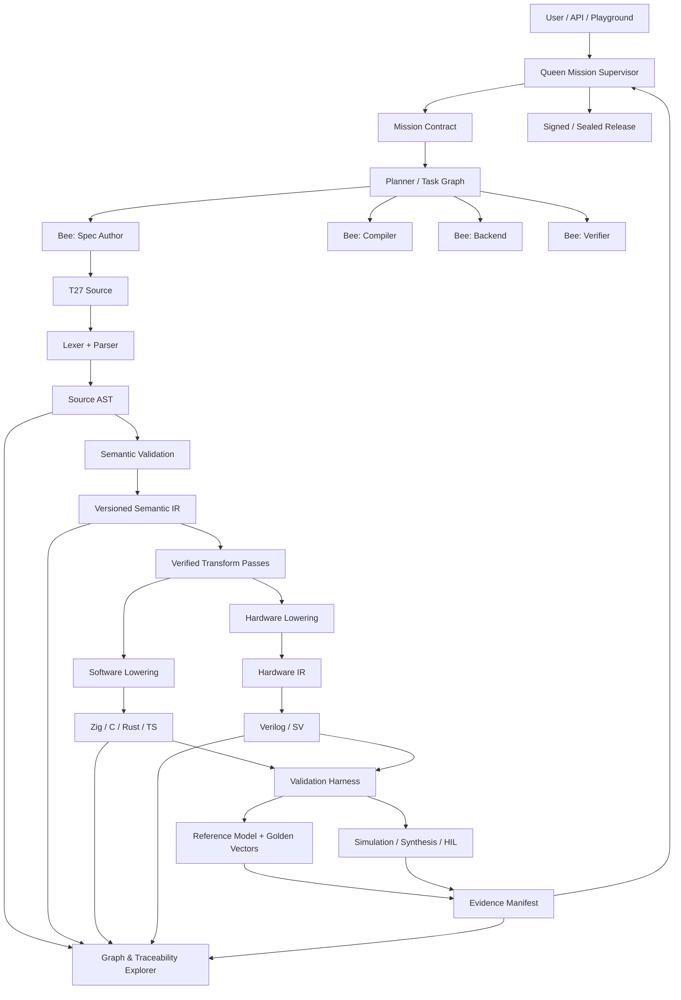
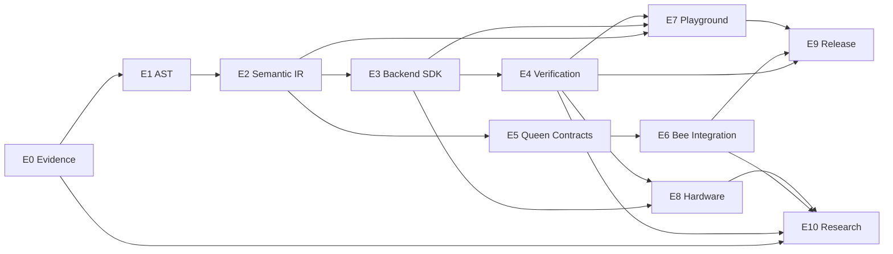

# Queen + T27 MVP Architecture

**Document type:** Architecture RFC, implementation blueprint, research plan, and coding-agent mission  
**File:** `Queen_T27_MVP_Architecture.md`  
**Status:** Draft for implementation  
**Version:** 1.0  
**Audit date:** 2026-08-23 (Asia/Bangkok)  
**Primary audience:** T27 maintainers, TriOS/Queen maintainers, coding agents, compiler engineers, hardware engineers, research collaborators, and early product contributors

---

## 0. Executive decision

The first public Queen + T27 product must prove one precise idea:

> **An AI agent should specify behavior once, validate the meaning before code generation, and then produce traceable, reproducible, conformant implementations for multiple software and hardware backends.**

The MVP is not “an agent that writes arbitrary code in every language.” That is the long-term vision. The MVP is a verifiable vertical slice:

1. A user or Queen writes a `.t27` specification.
2. The Rust compiler parses it into a source-preserving AST.
3. A dedicated semantic stage resolves names, types, effects, invariants, and backend capabilities.
4. The compiler lowers the validated program into a versioned semantic IR.
5. At least one software backend and one hardware backend are generated.
6. A conformance suite compares all runnable outputs against a reference model and golden vectors.
7. Every artifact carries provenance from the original specification to the generated file, test result, compiler build, and release.
8. The `t27.ai` Playground makes this entire path visible:
   **Spec → AST → Semantic IR → Generated Code → Verification → Hardware View**.
9. Queen delegates bounded implementation and review work to Bees, but deterministic gates—not model confidence—decide whether work is acceptable.

The public promise for MVP should therefore be:

> **Write the behavior once. Inspect every transformation. Reproduce every result.**

Not every currently documented backend is required for MVP. The current repository evidence supports prioritizing **Zig/C plus Verilog** as the initial proven path. A Rust backend is a high-priority extension. TypeScript and additional backends belong behind a capability contract and should not be advertised as production-ready until they pass the same conformance gates.

---

## 1. Evidence policy and audit integrity

This RFC intentionally separates observation from aspiration.

### 1.1 Evidence labels

| Label | Meaning |
|---|---|
| **[OBSERVED]** | Directly visible in repository metadata, source code, or a named file at the audited commit. |
| **[REPO-CLAIM]** | Stated by the repository README, STATUS, or documentation, but not independently rebuilt or re-measured during this audit. |
| **[INFERENCE]** | A conservative architectural conclusion supported by observed code, but not explicitly declared by the project. |
| **[TARGET]** | Proposed architecture or product behavior to implement. |
| **[LEGACY-CONCEPT]** | Historical or conceptual material that may inspire the target but is not treated as current implementation. |
| **[UNKNOWN]** | Requires a local build, full source traversal, hardware access, or maintainer confirmation. |

### 1.2 Repositories used

This document uses the following source repositories as the project audit scope:

| Repository | Branch | Audited commit | Role in this RFC |
|---|---:|---|---|
| [`gHashTag/t27`](https://github.com/gHashTag/t27) | `master` | `e7459f0fcb1f7d7b8c128879c6a6c586351054ec` | T27 language, Rust bootstrap compiler, software/RTL generation, conformance, seals, FPGA/assurance evidence |
| [`gHashTag/trios`](https://github.com/gHashTag/trios) | `main` | `35731a57e7625614984d92d1fa677d54c1c808ef` | Current Queen delegation, worker execution, lifecycle policy, review and branch isolation |
| [`gHashTag/trinity`](https://github.com/gHashTag/trinity) | `main` | `9ae12c0b075a99ec326af8465a93c13d394894df` | Ecosystem context and historical HIVE concepts |

The repositories are active and may change after this snapshot. Any implementation agent must re-record the current commit before changing code.

### 1.3 Explicitly excluded source

The fork under `dmitrii-f-t27/*` is **not** used as the source of truth for this RFC. No architecture, status, or backlog conclusion in this document depends on that fork.

### 1.4 Audit limitations

This audit inspected repository metadata, selected source files, current documentation, and official external project documentation. It did **not**:

- run the full T27 build and test suite locally;
- reproduce FPGA synthesis or board measurements;
- validate every backend advertised anywhere in historical documentation;
- prove semantic equivalence of generated outputs;
- inspect every Queen UI path and every test;
- verify hosted deployment state at `t27.ai`;
- establish legal ownership or authorship beyond repository evidence.

Consequently, numerical claims from project documentation remain **[REPO-CLAIM]** until reproduced by a sealed CI run.

---

## 2. Current-state audit

## 2.1 T27: what is present now

### 2.1.1 Product positioning

`gHashTag/t27` currently describes itself as a spec-first toolchain and numeric-format registry whose primary path is:

```text
.t27 specification
        ↓
Rust bootstrap compiler
        ↓
Zig / C / Verilog generation
        ↓
conformance, seals, simulation/synthesis evidence
```

The current README explicitly presents `.t27 → Zig, Verilog, C` and emphasizes a `.t27 → Verilog RTL → Tiny Tapeout` path. This is **[REPO-CLAIM]** until independently rebuilt, but the relevant compiler and source structure are **[OBSERVED]**.

### 2.1.2 Rust bootstrap compiler

**[OBSERVED]** `bootstrap/src/compiler.rs` contains:

- a Rust compiler core;
- explicit AST node kinds;
- a source node structure;
- a lexer;
- parser logic;
- code generation logic;
- source line information;
- language constructs for modules, declarations, functions, invariants, tests, benches, expressions, and statements.

At the audited snapshot, the top of the file identifies the module as a reusable T27 compiler core. The AST includes nodes such as:

```text
Module
UseDecl
ConstDecl
EnumDecl
StructDecl
FnDecl
InvariantBlock
TestBlock
BenchBlock
Expr*
Stmt*
```

This is important: the AST is not merely an idea. It exists in the bootstrap implementation.

### 2.1.3 Current compiler shape

The sampled implementation places AST definitions, lexer, parser, and substantial generation logic in a very large compiler module. Therefore:

- **[OBSERVED]** parsing and AST construction exist;
- **[INFERENCE]** the compiler core is currently more monolithic than the proposed target;
- **[UNKNOWN]** whether all semantic checks are centralized or are distributed among parsing, generation, validation scripts, and backend-specific logic;
- **[UNKNOWN]** whether a stable, versioned semantic IR contract currently exists;
- **[UNKNOWN]** whether a formal public backend plugin interface exists independently of the compiler implementation.

The target architecture must preserve working behavior while extracting explicit boundaries. A rewrite-from-zero is not justified.

### 2.1.4 Current backend evidence

The current README and STATUS provide the clearest conservative surface:

| Backend / output | Current assessment |
|---|---|
| Zig | **[REPO-CLAIM]** generated backend present and used |
| C | **[REPO-CLAIM]** generated backend present and used |
| Verilog | **[REPO-CLAIM]** generated RTL, simulation/synthesis evidence for selected modules |
| Rust | **[TARGET]** as a first-class public backend unless separately proven by current code/tests |
| TypeScript | **[TARGET]** after semantic and runtime capability rules exist |
| SystemVerilog assertions | **[REPO-CLAIM]** emitted in selected hardware flows |
| Other historical targets | Do not advertise without current conformance evidence |

This distinction is deliberate. The long-term backend vision is broad; the MVP claim must remain narrow and reproducible.

### 2.1.5 Assurance infrastructure

The repository contains or documents the following concepts:

- conformance vectors;
- generated-artifact headers;
- seals;
- test and invariant syntax;
- simulation/synthesis readiness levels;
- FPGA profiles;
- formal/proof surfaces;
- CLARA-oriented traceability;
- deterministic manifests for selected hardware flows.

Some of this is **[OBSERVED]** as files and commands; pass counts and hardware results remain **[REPO-CLAIM]** until rerun.

### 2.1.6 Current T27 architectural strengths

1. **Specification is already a first-class artifact.**
2. **AST construction is already implemented.**
3. **The compiler core is in Rust**, which is appropriate for deterministic systems tooling.
4. **Software and RTL outputs are already part of the repository story.**
5. **Conformance, seals, and evidence are product concepts, not afterthoughts.**
6. **The project already treats hardware claims conservatively through readiness levels.**
7. **Tests, invariants, and benchmarks are represented in the language surface.**

### 2.1.7 Current T27 architectural risks

1. **Monolithic compiler risk:** language semantics, parser behavior, and backend behavior can become coupled.
2. **Semantic drift risk:** if each backend interprets AST details independently, backends can disagree while all compiling successfully.
3. **Capability ambiguity:** a specification may use behavior that is valid for software but unsynthesizable in hardware.
4. **Claim drift:** documentation can outpace the current tested backend matrix.
5. **Traceability fragmentation:** seals, generated headers, conformance vectors, and CI evidence exist, but a unified transformation graph is not yet demonstrated.
6. **Versioning risk:** without a versioned semantic IR, old specifications and new compilers may silently change meaning.
7. **Scale risk:** a single oversized compiler module increases review cost and agent error probability.
8. **Generated-code authority risk:** hand edits or backend-local fixes can become untraceable unless generated outputs are immutable and regenerated from source.

---

## 2.2 Queen and Bees: what is present now

Queen/Bees is not only a metaphor. The TriOS repository contains concrete orchestration code.

### 2.2.1 Current Queen lifecycle

The documented control model is:

```text
OBSERVE → DECIDE → DELEGATE → VERIFY → INTEGRATE → REPEAT or ESCALATE
```

**[OBSERVED]** current task states include:

```text
queued
running
awaitingReview
accepted
rejected
cancelled
failed
```

**[OBSERVED]** legal state transitions are encoded in policy rather than left entirely to prompts.

### 2.2.2 Queen’s role

The current policy explicitly treats Queen as a supervisor rather than a coding worker:

- Queen may open, brief, review, and close worker chats.
- Queen is forbidden from direct code-writing and shell-style tools under the delegation policy.
- One live task is bound to one issue and one worker conversation.
- The orchestration layer records task lifecycle, usage, model/provider, files, and estimated cost.
- Failed or orphaned tasks are surfaced rather than silently archived.

This is a strong foundation for auditable agentic engineering.

### 2.2.3 Bee execution

**[OBSERVED]** `QueenWorkerRunner.swift`:

- creates an independent transport for each worker turn;
- keeps worker conversation state separate from Queen’s chat;
- streams worker progress;
- records token and tool usage;
- binds work to a specific GitHub issue;
- passes only the worker’s own prior conversation;
- instructs the worker not to delegate further;
- restricts editable paths where ownership is specified;
- reports a final result back to Queen.

This is context isolation, not merely parallel prompting.

### 2.2.4 Delegation registry and ownership

**[OBSERVED]** `QueenDelegationRegistry.swift`:

- persists swarm state as readable JSON;
- enforces one active task per issue;
- detects owned-path conflicts before delegation;
- limits concurrent workers;
- tracks stalls;
- preserves a review queue and archive;
- reconciles workers that died during application restart;
- records usage and cost information.

**[OBSERVED]** the current branch model uses deterministic Queen-prefixed virtual branch names and file ownership. The sampled code refers to GitButler virtual branches in a shared checkout, not one operating-system worktree per Bee. Any document that says “all Bees use separate git worktrees” would therefore overstate the current implementation.

### 2.2.5 Queen modules visible in the current source tree

The current SR-02 surface includes, among other modules:

- `QueenBackgroundService`
- `QueenBranchCommitter`
- `QueenCommandParser`
- `QueenDelegationRegistry`
- `QueenDelegationService`
- `QueenProposalApplier`
- `QueenReviewScheduler`
- `QueenSelfImprovementService`
- `QueenWorkerRunner`
- session recovery and repository-status components

This supports the conclusion that Queen is an implemented orchestration subsystem.

### 2.2.6 Current Queen strengths

1. **Issue-bound work contracts.**
2. **Explicit task lifecycle.**
3. **Context isolation between Queen and workers.**
4. **Bounded concurrency.**
5. **File ownership conflict checks.**
6. **Deterministic branch naming.**
7. **Human-readable persistent operational state.**
8. **Review and rejection paths.**
9. **Cost and usage visibility.**
10. **A policy that prevents Queen from becoming another unbounded coder.**

### 2.2.7 Current Queen gaps relative to the T27 vision

1. **No demonstrated canonical Queen → T27 mission contract.**
2. **Worker completion can still be conversational rather than artifact-contract based.**
3. **No unified provenance manifest spans Queen decision, Bee task, specification delta, compiler run, backend artifact, and validation result.**
4. **No demonstrated semantic-diff reviewer for `.t27` changes.**
5. **No demonstrated quorum or competing-proposal mechanism for high-risk architecture choices.**
6. **No uniform evidence score tying tests, conformance, determinism, and reproducibility to acceptance.**
7. **No demonstrated remote/cloud execution contract that preserves the same local guarantees.**
8. **No demonstrated hardware-in-the-loop gate integrated into Queen’s acceptance policy.**
9. **Virtual-branch isolation is useful but must be stress-tested against concurrent edits, tool behavior, and recovery.**
10. **The T27 compiler’s backend capability model is not yet exposed as a Queen planning primitive.**

---

## 2.3 Historical HIVE concepts

The Trinity repository contains a historical HIVE architecture with roles such as Queen, foragers, workers, guards, shared memory, signaling, and task decomposition.

This is useful as **[LEGACY-CONCEPT]**, not as proof of current execution.

The reusable ideas are:

- specialized roles;
- local task context;
- shared artifact state;
- positive recruitment for promising work;
- negative feedback and cancellation;
- independent validation roles;
- memory tiers;
- stigmergic coordination through artifacts;
- quorum-like decisions for ambiguous choices.

The target must not copy bee biology literally. Software engineering requires stronger ownership, deterministic gates, security boundaries, and explicit rollback than a biological colony.

---

## 3. Product thesis

## 3.1 Problem

Direct LLM code generation has several recurring failure modes:

- the model starts coding before acceptance criteria exist;
- behavior is implicit in generated code rather than captured as a contract;
- tests are added after the implementation and merely confirm the implementation’s own assumptions;
- different languages implement subtly different semantics;
- hardware and software versions diverge;
- agents overwrite or duplicate each other’s work;
- generated artifacts lack provenance;
- bugs reappear because fixes do not become permanent regression tests;
- a successful demo cannot be reproduced on another machine;
- reviewers cannot see how a user’s intent became a binary or RTL block.

These failures are expensive in ordinary software and potentially catastrophic before FPGA, ASIC, or silicon manufacturing.

## 3.2 Solution

Queen + T27 converts development into a contract-driven compilation process:

```text
User intent
   ↓
Queen mission contract
   ↓
Bee-authored or human-authored T27 specification
   ↓
Parser + source AST
   ↓
Semantic validation
   ↓
Versioned semantic IR
   ↓
Backend-specific lowering
   ↓
Generated software / RTL
   ↓
Reference execution + conformance + regression + formal/hardware gates
   ↓
Sealed release with complete provenance
```

## 3.3 Value proposition

For engineering teams:

- fewer ambiguous requirements;
- fewer late-stage semantic defects;
- one specification across multiple implementations;
- earlier backend capability errors;
- reproducible releases;
- auditable agent work;
- faster backend bring-up;
- explainable software-to-hardware traceability.

For AI agents:

- smaller and more formal action space;
- explicit invariants and acceptance criteria;
- compiler diagnostics instead of vague reviewer feedback;
- reusable bug-to-test memory;
- deterministic completion gates.

For research:

- a measurable comparison between direct agentic coding and spec-first agentic compilation;
- cross-backend equivalence as an objective metric;
- end-to-end provenance as an empirical systems property.

---

## 4. Architectural principles

### P1. Specification is the source of truth

Generated source, RTL, test scaffolding, manifests, and visualizations are derived artifacts. They must not become competing authorities.

### P2. Meaning is validated before backend emission

Syntax success is insufficient. Names, types, invariants, effects, determinism constraints, resource constraints, and backend capabilities must be checked before code generation.

### P3. Preserve information until it is no longer useful

Do not lower high-level semantics too early. Once intent is reduced to generic control flow, later passes cannot reliably recover it. This follows the progressive-lowering lesson demonstrated by MLIR.

### P4. Every transformation is traceable

Every generated node must retain origin links to source nodes and transformation steps.

### P5. Every accepted bug becomes a permanent test

A bug is not closed when code changes. It is closed when:

1. the failure is reproduced;
2. a regression test fails before the fix;
3. the fix passes;
4. the test becomes part of the release gate;
5. provenance links the issue to the test and change.

### P6. Queen supervises; Bees execute bounded contracts

Queen owns decomposition, evidence, integration, and escalation. Bees own narrow work units. Queen does not silently become a general-purpose coding agent.

### P7. Tests and gates outrank model confidence

No model statement such as “done,” “correct,” or “verified” has authority without machine-readable evidence.

### P8. Backends declare capabilities

A backend must state what it supports. Unsupported semantics must fail early and explainably, not degrade silently.

### P9. Reproducibility is a release property

A release is incomplete unless another machine can reconstruct and verify its outputs from pinned inputs.

### P10. MVP claims are narrower than the vision

Only backends and workflows with current, reproducible evidence are advertised as shipped.

---

## 5. Target system architecture



## 5.1 Component boundaries

### Queen

Owns:

- mission definition;
- task graph;
- issue binding;
- Bee selection;
- context minimization;
- budget and concurrency;
- evidence review;
- integration policy;
- escalation.

Does not own:

- ad hoc direct code edits;
- bypassing compiler errors;
- accepting work based on prose alone.

### Bees

Each Bee receives:

- one issue or task contract;
- explicit owned paths;
- allowed tools;
- required input artifacts;
- required output artifacts;
- acceptance criteria;
- resource budget;
- termination conditions.

A Bee may be specialized as:

- specification author;
- parser/compiler engineer;
- backend engineer;
- test/oracle engineer;
- hardware verification engineer;
- documentation/research engineer;
- security reviewer;
- release engineer.

### T27 compiler

Owns:

- syntax;
- source AST;
- semantic analysis;
- IR schemas;
- deterministic transformations;
- backend interface;
- provenance map;
- diagnostics.

### Validation harness

Owns:

- reference execution;
- golden vectors;
- differential tests;
- regression tests;
- property tests;
- backend conformance;
- deterministic replay;
- simulation and synthesis invocation;
- evidence collection.

### Playground

Owns:

- interactive authoring;
- agent-assisted specification;
- build visualization;
- diagnostics;
- backend selection;
- evidence display;
- shareable sealed examples.

---

## 6. Compiler architecture

## 6.1 Preserve the existing compiler; extract layers

The current Rust bootstrap is valuable working capital. The target is an incremental decomposition:

```text
bootstrap/src/compiler.rs
        ↓ incremental extraction
crates/
  t27-source
  t27-lexer
  t27-syntax
  t27-ast
  t27-sema
  t27-ir
  t27-transform
  t27-backend-api
  t27-backend-zig
  t27-backend-c
  t27-backend-verilog
  t27-driver
  t27-provenance
  t27-harness
```

Do not require this exact directory structure on day one. The architectural rule is more important than the names:

> Parsing, semantics, backend lowering, emission, and verification must have explicit interfaces and independent tests.

## 6.2 Stage A: source model

The source layer owns:

- source files;
- module paths;
- UTF-8 handling;
- canonical line endings;
- source spans;
- comments and documentation;
- import resolution inputs;
- diagnostic rendering.

Every source file receives:

```text
SourceFileId
content hash
module identity
repository-relative path
spec language version
```

## 6.3 Stage B: lexer and parser

The parser must produce a **loss-aware source AST**:

- source spans on every node;
- original symbol spellings;
- comments/doc attachment where needed;
- recoverable diagnostics;
- stable node IDs;
- no backend-specific interpretation.

Parsing must be deterministic and side-effect free.

### Parser acceptance criteria

- Same bytes + same language version → same AST serialization.
- Invalid input yields structured diagnostics, never silent token dropping.
- Error recovery does not invent executable semantics.
- AST can round-trip through a canonical debug representation.
- Parser fuzzing cannot crash or hang within configured limits.
- Every historical parser bug has a regression fixture.

## 6.4 Stage C: semantic analysis

This is the most important missing or insufficiently explicit layer.

Semantic analysis should resolve:

- modules and imports;
- declarations and references;
- type identities;
- numeric widths and signedness;
- optionality and nullability;
- effects;
- mutability;
- control-flow validity;
- exhaustiveness;
- constant evaluation;
- invariant syntax and scope;
- deterministic versus nondeterministic operations;
- synthesizability;
- backend capability requirements;
- resource constraints;
- undefined or implementation-dependent behavior.

### Semantic result

Semantic analysis produces either:

```text
ValidatedProgram
```

or a nonzero diagnostic set. Backends must not receive an unvalidated program.

### Diagnostics

Each diagnostic must include:

- stable code, such as `T27-E-TYPE-001`;
- source span;
- message;
- explanation;
- suggested fix where safe;
- violated rule;
- related nodes;
- backend scope, if applicable.

Diagnostics are a public API for Queen and the Playground.

## 6.5 Stage D: versioned semantic IR

A source AST should not be the universal backend API. AST mirrors syntax; backends need resolved meaning.

Proposed IR hierarchy:

```text
T27 AST
  ↓ resolve names, types, invariants
T27 HIR / Semantic IR
  ↓ normalize control and data behavior
T27 Core IR
  ↓ target capability and schedule decisions
Software IR          Hardware IR
  ↓                    ↓
Zig/C/Rust/TS         Verilog/SV/CIRCT bridge
```

The names may change. The separation must remain.

### Semantic IR properties

- typed;
- symbol-resolved;
- explicit control flow;
- explicit numeric semantics;
- explicit overflow/rounding behavior;
- explicit effects;
- explicit invariants;
- serializable;
- schema-versioned;
- canonical textual debug format;
- canonical binary or JSON form for tooling;
- source-origin metadata;
- transformation history.

### Versioning

Every serialized IR package includes:

```json
{
  "t27_language_version": "x.y",
  "semantic_ir_version": "x.y",
  "compiler_build": "<digest>",
  "feature_set": ["..."],
  "source_digest": "<sha256>",
  "created_by": "<tool and version>"
}
```

Adopt the lesson of StableHLO/VHLO: compatibility requires an explicit versioning policy, not an assumption that old IR will always parse.

## 6.6 Stage E: transformation pipeline

Passes must declare:

- input IR version;
- required invariants;
- preserved invariants;
- output IR version;
- determinism;
- provenance behavior;
- whether semantic equivalence is proven, tested, or assumed.

Each pass emits a transformation record:

```json
{
  "pass": "constant-fold",
  "version": "1.2.0",
  "input_digest": "...",
  "output_digest": "...",
  "origin_edges": 147,
  "warnings": []
}
```

A debug mode stores snapshots after each pass for the Playground.

## 6.7 Stage F: backend capability negotiation

Before lowering, the compiler asks a backend whether the validated program is supported.

Example capabilities:

```text
integer widths
floating formats
balanced ternary values
dynamic allocation
recursion
exceptions
threads
nondeterminism
I/O
unbounded loops
runtime strings
hardware clocks/resets
pipeline latency
memory ports
formal assertions
```

A backend returns:

```text
Supported
SupportedWithLowering
Unsupported(reason, source spans, alternatives)
```

This prevents “successful” generation that changes meaning.

---

## 7. Backend SDK

## 7.1 Proposed Rust interface

Illustrative interface:

```rust
pub trait Backend {
    fn descriptor(&self) -> BackendDescriptor;

    fn check_capabilities(
        &self,
        program: &SemanticProgram,
        config: &BackendConfig,
    ) -> DiagnosticSet;

    fn lower(
        &self,
        program: &SemanticProgram,
        config: &BackendConfig,
        provenance: &mut ProvenanceGraph,
    ) -> Result<BackendModule, DiagnosticSet>;

    fn emit(
        &self,
        module: &BackendModule,
        sink: &mut ArtifactSink,
    ) -> Result<ArtifactSet, BackendError>;

    fn verify(
        &self,
        artifacts: &ArtifactSet,
        harness: &HarnessContext,
    ) -> Result<VerificationReport, VerificationError>;
}
```

This is a target design, not a claim about the current API.

## 7.2 Backend descriptor

```json
{
  "id": "verilog",
  "version": "1.0.0",
  "kind": "hardware",
  "deterministic": true,
  "capabilities": {
    "recursion": false,
    "dynamic_memory": false,
    "bounded_loops_required": true,
    "assertions": true
  },
  "required_tools": {
    "iverilog": "pinned",
    "yosys": "pinned"
  }
}
```

## 7.3 Backend priority

### MVP-supported

1. **Zig or C reference software backend**
2. **Verilog hardware backend**

Selection between Zig and C as the canonical reference should be made through a measured gate:

- semantic coverage;
- compiler availability;
- deterministic behavior;
- ease of sandboxing;
- compatibility with existing conformance vectors;
- speed;
- ease of integrating into browser/server Playground.

### P1

- Rust backend;
- SystemVerilog assertions and richer hardware diagnostics;
- WebAssembly execution path for browser-side reference tests.

### P2

- TypeScript;
- LLVM IR bridge;
- CIRCT/MLIR bridge;
- CUDA/Metal or accelerator dialects;
- additional HDL and proof targets.

## 7.4 Reference implementation

The reference backend is not necessarily the fastest. It is the simplest trusted executable semantics.

Requirements:

- deterministic;
- intentionally conservative;
- easy to inspect;
- high semantic coverage;
- instrumentable;
- produces trace events;
- suitable as a test oracle;
- not optimized in ways that obscure meaning.

The reference implementation and golden vectors jointly define expected behavior. Neither should be silently regenerated after a failure.

---

## 8. Provenance and traceability

## 8.1 Provenance graph

Every artifact is a node in a directed acyclic graph:

```text
User request
  → Queen mission
  → GitHub issue
  → Bee briefing
  → T27 source revision
  → AST
  → Semantic IR
  → pass snapshots
  → backend IR
  → generated source/RTL
  → compiler/toolchain build
  → test/simulation/synthesis result
  → release manifest
```

Each node contains:

- unique ID;
- content digest;
- type;
- producer;
- timestamp;
- source commit;
- tool version;
- configuration;
- parent artifact IDs;
- verification status.

Each edge has a transformation type:

```text
authored-from
parsed-from
validated-from
lowered-from
generated-from
tested-by
compared-against
approved-by
released-as
```

## 8.2 Origin metadata

Every AST and IR operation carries an `OriginSet`:

```text
source file
source span
source node ID
parent IR node IDs
transform pass ID
issue/task ID
```

If one source construct expands into many operations, each operation points back to the same source origin. If an optimization combines operations, the resulting node retains all contributing origins.

## 8.3 Artifact manifest

Every build produces a canonical manifest:

```json
{
  "schema": "t27.build-manifest/1",
  "source": {
    "repository": "gHashTag/t27",
    "commit": "...",
    "specs": [{"path": "...", "sha256": "..."}]
  },
  "compiler": {
    "version": "...",
    "binary_sha256": "...",
    "rust_toolchain": "...",
    "semantic_ir_version": "..."
  },
  "backend": {
    "id": "verilog",
    "version": "...",
    "config_sha256": "..."
  },
  "artifacts": [
    {"path": "...", "sha256": "...", "origin_map": "..."}
  ],
  "verification": {
    "conformance": "pass",
    "regression": "pass",
    "simulation": "pass",
    "synthesis": "not_run"
  }
}
```

## 8.4 Traceability in the Playground

Clicking a source expression should highlight:

- its AST node;
- semantic type and invariants;
- normalized IR operations;
- generated software lines;
- generated RTL signals/blocks;
- tests that cover it;
- current verification status;
- transformation history.

The reverse must also work: click an RTL signal and locate its originating T27 construct.

---

## 9. Verification architecture

## 9.1 Validation pyramid

```text
Level 0  Parser and diagnostic tests
Level 1  Semantic/type/invariant tests
Level 2  Property and metamorphic tests
Level 3  Reference backend execution
Level 4  Cross-backend conformance
Level 5  Regression and mutation gates
Level 6  RTL simulation and logical equivalence
Level 7  Synthesis constraints and timing/resource checks
Level 8  Hardware-in-the-loop
Level 9  Silicon evidence
```

Not every specification reaches every level. Readiness must be explicit.

## 9.2 Golden vectors

A golden vector pack contains:

- input;
- expected output;
- expected trace where relevant;
- numeric mode;
- rounding/overflow mode;
- source specification digest;
- oracle version;
- provenance;
- reason for inclusion;
- issue that introduced it.

Golden vectors must be immutable. A changed expectation creates a new version and requires explicit semantic-review approval.

## 9.3 Conformance suite

The conformance suite must answer:

> Does each backend implement the same validated T27 semantics?

For each vector:

1. run reference model;
2. run software backend output;
3. run RTL simulation where applicable;
4. compare canonical outputs;
5. compare bit-exact outputs where required;
6. compare traces where final output alone is insufficient;
7. produce a structured discrepancy report.

## 9.4 Differential testing

Where multiple independent implementations exist:

```text
reference interpreter
vs Zig
vs C
vs Rust
vs RTL simulator
```

Any disagreement is a defect until explained by an explicit capability or numeric policy.

## 9.5 Property-based testing

Properties should be attached to semantic constructs, not only generated source. Examples:

- encode/decode round-trip;
- bounds preservation;
- monotonicity;
- commutativity where specified;
- identity laws;
- no illegal state transition;
- invariants before and after every public operation;
- deterministic replay.

## 9.6 Metamorphic testing

Generate transformed inputs whose outputs must have a known relationship:

- permutation invariance;
- scale relations;
- algebraic identities;
- equivalent control-flow forms;
- formatting/comment changes that must not change AST semantics;
- backend-independent refactoring.

## 9.7 Mutation testing

Mutation gates are especially important for agent-written tests. A test that never fails under relevant mutations provides weak evidence.

Required mutation classes:

- comparison boundary changes;
- removed invariant checks;
- swapped branches;
- width off-by-one;
- signed/unsigned reinterpretation;
- dropped optional marker;
- altered rounding mode;
- stale golden vector;
- skipped backend verification;
- false-positive gate behavior.

## 9.8 Reproducibility suite

A release candidate must be rebuilt:

- in a clean pinned environment;
- on at least two independent runners;
- with network access disabled after dependency materialization;
- from the same source and lockfiles.

The suite compares:

- manifest digests;
- generated source digests;
- test vectors;
- compiler outputs;
- binaries where reproducible toolchains permit;
- RTL;
- reports.

Differences must be classified, not ignored.

---

## 10. Hermetic build and release pipeline

## 10.1 Build inputs

Pinned inputs include:

- repository commit;
- submodule commits;
- Rust toolchain;
- `Cargo.lock`;
- compiler flags;
- backend versions;
- simulator/synthesis versions;
- board/process profile;
- environment variables;
- locale and timezone where relevant;
- random seeds;
- model/provider identifiers for agent-generated artifacts.

## 10.2 Build isolation

MVP should provide one canonical reproducible environment:

- OCI container or equivalent;
- no unpinned package installation;
- no network during build/test phase;
- read-only source input;
- writable isolated artifact directory;
- resource limits;
- deterministic timestamps or normalized archives.

Nix/Bazel may be evaluated later, but adding a new build system must not delay the first reproducible containerized release.

## 10.3 Release artifacts

A release contains:

- `t27c` binaries for supported platforms;
- installer/checksum instructions;
- language specification;
- semantic IR schema;
- backend capability matrix;
- Playground example pack;
- conformance vector pack;
- build manifest;
- SBOM;
- signatures or seals;
- provenance graph;
- known limitations;
- exact verification report.

## 10.4 Installation UX

Target:

```bash
curl -fsSL https://t27.ai/install.sh | sh
t27c doctor
t27c build hello.t27 --backend c
t27c build hello.t27 --backend verilog
t27c verify hello.t27 --all
t27c explain hello.t27
```

For security-sensitive audiences, direct release download plus checksum/signature verification must be documented as the preferred method.

## 10.5 `t27c doctor`

`doctor` reports:

- compiler version and digest;
- language/IR schema versions;
- installed backend tools;
- simulator/synthesis availability;
- lockfile status;
- environment reproducibility warnings;
- unsupported platform features.

---

## 11. Queen–T27 integration

## 11.1 Mission contract

Queen converts a user request into a machine-readable mission:

```yaml
mission:
  id: Q-2026-0001
  objective: "Implement a bounded ternary accumulator"
  repository: "..."
  source_of_truth:
    spec: "specs/accumulator.t27"
  required_backends:
    - c
    - verilog
  invariants:
    - "accumulator remains within configured width"
    - "reset produces zero"
  acceptance:
    - "semantic validation passes"
    - "golden vectors pass on C and RTL simulation"
    - "reproducibility manifest matches on two runners"
  prohibited:
    - "hand-edit generated files"
    - "change golden outputs without semantic approval"
```

This contract is the issue-level source of truth for Queen.

## 11.2 Task graph

Queen decomposes the mission into typed tasks:

```text
Specify
Validate semantics
Implement compiler support
Implement backend support
Create oracle/vectors
Run conformance
Review provenance
Integrate
Release
```

Each task declares dependencies and artifact outputs.

## 11.3 Bee result contract

A Bee result is structured:

```json
{
  "task_id": "...",
  "status": "completed",
  "base_commit": "...",
  "result_commit": "...",
  "changed_specs": [],
  "changed_compiler_files": [],
  "generated_artifacts": [],
  "tests_added": [],
  "commands_run": [],
  "evidence_manifest": "...",
  "known_risks": [],
  "human_decisions_required": []
}
```

A prose summary may accompany it but cannot replace it.

## 11.4 Acceptance policy

Queen may accept only when:

- task state is valid;
- owned paths were respected;
- source branch is current or safely rebased;
- required tests executed;
- semantic validation passed;
- required conformance passed;
- provenance complete;
- no unexplained manifest drift;
- no policy veto;
- evidence artifacts are readable.

High-risk changes require human review:

- language semantic changes;
- IR schema changes;
- golden expectation changes;
- cryptographic/signing changes;
- hardware constraint changes;
- automatic acceptance policy changes;
- security boundary changes.

## 11.5 Competing proposals

For ambiguous architecture decisions, Queen may delegate two independent design Bees. A reviewer Bee compares them against a decision rubric.

This borrows from honeybee evidence accumulation without pretending that code integration is biological consensus.

Decision rubric:

- correctness;
- simplicity;
- backward compatibility;
- testability;
- deterministic behavior;
- performance evidence;
- migration cost;
- security;
- traceability.

## 11.6 Stop signals and cancellation

A task receives a stop signal when:

- it edits outside ownership;
- it repeatedly fails the same gate without new evidence;
- it exceeds budget;
- its base assumptions are invalidated;
- another task establishes a superior canonical solution;
- it produces no artifacts or tool activity;
- the repository changes make its work obsolete.

Stop signals must be recorded and explainable.

---

## 12. Bee-inspired architecture: useful parallels and limits

Scientific work on honeybee collective choice shows decentralized evidence accumulation, local signaling, quality-weighted recruitment, quorum thresholds, and inhibitory stop signals. Honeybee division of labor also emerges from local rules and changing colony demand.

Useful mappings:

| Honeybee mechanism | Queen/Bees mapping |
|---|---|
| Scout independently evaluates a site | Design Bee independently evaluates a solution |
| Waggle dance communicates value | Proposal artifact communicates evidence |
| Dance vigor reflects quality | Evidence score reflects tests, simplicity, performance |
| Recruitment | Queen allocates more review/implementation effort |
| Quorum threshold | Merge/readiness threshold |
| Stop signal / cross-inhibition | Cancellation, veto, or counter-evidence |
| Division of labor | Specialized Bee roles |
| Local information | Minimal task-specific context |
| Colony memory through environment | Git issues, artifacts, manifests, tests |
| Self-organization | Dynamic task selection from explicit demand |

Limits:

1. A biological queen does not operate as a software project manager; the name is metaphorical.
2. Repository writes require explicit ownership and serialization.
3. Security requires identity, authorization, and audit.
4. Software artifacts need deterministic state transitions.
5. Consensus cannot override failing tests.
6. “Emergence” is not a substitute for a specification.
7. Unbounded swarms amplify cost and merge conflict.
8. Model diversity is useful only when evaluation is independent and comparable.

The right design is therefore a **hybrid**:

- decentralized exploration;
- centralized mission/accountability;
- artifact-mediated coordination;
- deterministic verification;
- explicit integration authority.

---

## 13. `t27.ai` Playground

## 13.1 Product role

The Playground should be the primary interactive proof of the project, placed directly below the main hero section.

A visitor should understand the thesis without reading the repository:

1. choose an example or describe a goal;
2. receive/edit a T27 specification;
3. press **Build**;
4. watch the compiler stages;
5. compare software and hardware outputs;
6. inspect conformance evidence;
7. share a sealed build.

## 13.2 Core screens

### Screen 1: Specification editor

- Monaco/CodeMirror editor;
- syntax highlighting;
- inline diagnostics;
- completion from language schema;
- agent chat that proposes spec changes as diffs;
- explicit acceptance before applying agent changes;
- version and backend selectors.

### Screen 2: Source AST

- collapsible tree;
- graph mode;
- source span highlighting;
- node types;
- stable node IDs;
- parser diagnostics;
- downloadable canonical AST JSON.

### Screen 3: Semantic view

- resolved symbols;
- types;
- effects;
- invariants;
- backend capability warnings;
- control/data dependencies;
- unsupported behavior explanations.

### Screen 4: IR Explorer

- semantic IR graph;
- pass timeline;
- before/after diff for each pass;
- origin links;
- invariant preservation status;
- ability to freeze at a stage.

### Screen 5: Generated outputs

Tabs:

- Zig;
- C;
- Verilog;
- Rust when ready;
- TypeScript when ready;
- manifest;
- source map.

Selecting generated code highlights its source and IR origins.

### Screen 6: Hardware view

MVP:

- module hierarchy;
- ports;
- registers;
- combinational nodes;
- state machines;
- pipeline stages;
- width annotations;
- clock/reset domain;
- warnings for unsynthesizable constructs.

Later:

- CIRCT/MLIR view;
- critical path;
- resource estimates;
- board mapping;
- floorplan and silicon projection.

### Screen 7: Verification

- golden vector table;
- pass/fail per backend;
- bit-exact comparison;
- trace-based comparison;
- regression history;
- simulator logs;
- synthesis status;
- evidence confidence;
- downloadable report.

### Screen 8: Provenance timeline

```text
Prompt
→ Mission
→ Spec commit
→ AST digest
→ IR digest
→ Backend version
→ Generated artifact
→ Test run
→ Release seal
```

## 13.3 Execution architecture

### MVP approach: server-side sandbox

```text
Browser
  → Playground API
  → queued build job
  → isolated compiler container
  → artifact store
  → streamed diagnostics/events
  → signed temporary result URL
```

Requirements:

- strict CPU/memory/time limits;
- no arbitrary host filesystem access;
- network disabled in compiler job;
- output size limits;
- rate limiting;
- abuse monitoring;
- immutable job inputs;
- content-addressed artifacts;
- automatic expiry.

### Later approach: browser WASM

Compile parser, AST, semantic diagnostics, and reference execution to WebAssembly for instant feedback. Keep heavy RTL tools and synthesis server-side.

## 13.4 Shareable demo

A shared link resolves to an immutable build package:

```text
https://t27.ai/p/<manifest-digest>
```

The page shows:

- specification;
- compiler version;
- outputs;
- evidence;
- reproducibility command;
- whether the build is official, community, or untrusted.

## 13.5 Playground MVP examples

1. Hello arithmetic function → C + Zig.
2. Bounded accumulator → C + Verilog.
3. Small finite-state machine → reference trace + Verilog.
4. Numeric encode/decode → golden vectors.
5. Bug demonstration → failing vector, fix, regression result.
6. Queen mission demonstration → issue → Bee → spec → verified artifact.

---

## 14. Comparison with related compiler systems

The goal is not to claim that T27 replaces mature compiler ecosystems. The goal is to adopt proven architecture while preserving T27’s distinctive spec-first, agentic, software-to-hardware traceability.

## 14.1 Comparison matrix

| System | Primary strength | Lesson for T27 | What T27 should not copy blindly |
|---|---|---|---|
| LLVM | Typed low-level SSA IR, mature optimization/codegen ecosystem | Reuse mature low-level codegen where appropriate; keep IR well-formedness explicit | Do not lower T27 semantics directly to low-level LLVM IR before invariants and hardware meaning are preserved |
| MLIR | Extensible dialects and progressive lowering across abstraction levels | Use multiple explicit IR levels, dialect-like capability boundaries, verified passes | Avoid adopting MLIR complexity before the MVP semantic contract is stable |
| CIRCT | Hardware-oriented MLIR dialects, Verilog/SystemVerilog flows, verification/synthesis tooling | Consider a hardware IR bridge; learn from HW/Comb/Seq/FSM/Verif separation | Do not promise complete HLS or silicon flow merely because Verilog can be emitted |
| Halide | Separates algorithm from schedule | Separate what behavior means from how a target maps, pipelines, stores, or parallelizes it | T27 is broader than image/tensor pipelines; do not force every domain into Halide’s model |
| Apache TVM | Multi-level ML IR, graph + tensor program abstractions, target tuning | Treat semantic graph and target schedule as separate; use measurements for optimization | Do not make auto-tuning a prerequisite for correctness |
| XLA | Pluggable high-performance compilation for ML hardware | Define clear frontend/backend boundaries and capability contracts | XLA’s tensor focus is not a universal program semantics model |
| StableHLO/VHLO | Portable, versioned operation set and compatibility window | Version semantic IR and serialization; make compatibility producer-visible | Do not freeze an unstable operation set prematurely |
| Cranelift | Fast, embeddable, retargetable low-level code generation | Potential fast software execution backend; useful model for a compact backend interface | Do not use low-level codegen IR as the source of T27 semantics |

## 14.2 LLVM

LLVM IR is a typed SSA representation designed as a common low-level compiler representation. T27 can benefit from an LLVM path for mature machine code generation, but LLVM should be a **lowering target**, not the source of truth.

Decision:

- Keep T27 semantic types, invariants, ternary/numeric meaning, and hardware capabilities above LLVM.
- Add an LLVM backend only after semantic IR is stable.
- Validate against the reference backend before optimizing LLVM output.

Official reference: [LLVM Language Reference](https://llvm.org/docs/LangRef.html)

## 14.3 MLIR

MLIR’s strongest lesson is progressive lowering: high-level structure should remain available until the transformations that need it are complete.

Decision:

- model T27’s semantic IR explicitly;
- create separate software and hardware lowering layers;
- preserve source origins through every pass;
- evaluate an MLIR bridge after the internal contract is proven.

Official references:

- [MLIR Rationale](https://mlir.llvm.org/docs/Rationale/Rationale/)
- [MLIR Dialects](https://mlir.llvm.org/docs/Dialects/)
- [Linalg progressive-lowering rationale](https://mlir.llvm.org/docs/Rationale/RationaleLinalgDialect/)

## 14.4 CIRCT

CIRCT applies MLIR/LLVM methodology to circuit design and exposes hardware, sequential, FSM, SystemVerilog, verification, SMT, and synthesis-oriented dialects.

Decision:

- do not reinvent every hardware abstraction;
- define a clean T27 Hardware IR;
- prototype export to CIRCT for selected modules;
- compare T27-generated Verilog directly against a CIRCT path;
- use logical equivalence and bounded model checking where feasible.

Official references:

- [CIRCT project](https://circt.llvm.org/)
- [CIRCT dialects](https://circt.llvm.org/docs/Dialects/)
- [CIRCT verification tools](https://circt.llvm.org/docs/Tools/)

## 14.5 Halide

Halide separates the algorithm from the execution schedule. That is closely aligned with T27’s need to keep behavior independent from target mapping.

Decision:

- T27 specification expresses behavior and constraints;
- backend schedule/config expresses tiling, pipelining, memory layout, and target mapping;
- optimization changes must not modify semantic output;
- schedule search is optional and evidence-driven.

Official reference: [Halide](https://halide-lang.org/)

## 14.6 Apache TVM

TVM separates higher-level graph representation from lower-level tensor program representation and supports composable transformation and target-specific scheduling.

Decision:

- use a multi-level program representation;
- keep target performance choices outside canonical semantics;
- store optimization traces;
- compare candidate schedules using reproducible benchmarks.

Official references:

- [TVM architecture](https://tvm.apache.org/docs/arch/index.html)
- [TVM Relax](https://tvm.apache.org/docs/deep_dive/relax/index.html)
- [TVM TensorIR](https://tvm.apache.org/docs/deep_dive/tensor_ir/index.html)

## 14.7 XLA and StableHLO

XLA demonstrates pluggable compilation across CPUs, GPUs, and accelerators. StableHLO demonstrates a portability layer and VHLO demonstrates explicit versioned serialization.

Decision:

- define a versioned T27 semantic operation set;
- publish compatibility guarantees;
- make unsupported downgrade explicit at build time;
- separate framework-facing semantics from backend implementation.

Official references:

- [OpenXLA / StableHLO](https://openxla.org/)
- [XLA](https://openxla.org/xla)
- [VHLO versioning](https://openxla.org/stablehlo/vhlo)

## 14.8 Cranelift

Cranelift is a retargetable low-level code generator optimized for embedding and compilation speed.

Decision:

- evaluate Cranelift as an optional fast software execution/JIT backend;
- keep T27 semantic validation above Cranelift;
- use differential testing against the reference backend;
- avoid making Cranelift API stability a public T27 compatibility boundary.

Official reference: [Cranelift code generator](https://github.com/bytecodealliance/wasmtime/tree/main/cranelift)

---

## 15. Gap analysis

| Capability | Current evidence | Target state | Priority |
|---|---|---|---|
| `.t27` source language | **[OBSERVED]** | Stable versioned language contract | P0 |
| Rust bootstrap compiler | **[OBSERVED]** | Modular, testable compiler crates | P0 |
| Source AST | **[OBSERVED]** | Source-preserving AST with stable IDs and schema | P0 |
| Dedicated semantic analysis boundary | **[UNKNOWN / partial]** | Mandatory semantic gate before every backend | P0 |
| Versioned semantic IR | **[UNKNOWN]** | Canonical serialized SIR with compatibility policy | P0 |
| Backend plugin API | **[UNKNOWN / likely embedded]** | Stable capability-driven Rust interface | P0 |
| Zig/C generation | **[REPO-CLAIM]** | Verified MVP software backend(s) | P0 |
| Verilog generation | **[REPO-CLAIM]** | Verified MVP hardware backend | P0 |
| Rust generation | **[TARGET]** | Conformant P1 backend | P1 |
| TypeScript generation | **[TARGET]** | Capability-limited P2 backend | P2 |
| Golden vectors | **[OBSERVED / REPO-CLAIM]** | Versioned immutable packs linked to issues | P0 |
| Unified conformance harness | **[partial]** | One command, structured report, all backends | P0 |
| Full provenance DAG | **[partial seals/manifests]** | Cross-layer graph from mission to release | P0 |
| Reproducible build | **[REPO-CLAIM / partial]** | Independent two-runner reproduction gate | P0 |
| Queen delegation | **[OBSERVED]** | Mission-contract-driven orchestration | P0 |
| Bee context isolation | **[OBSERVED]** | Artifact contract + sandbox + path ownership | P0 |
| Queen/T27 bridge | **[not demonstrated]** | Queen emits and reviews T27 mission/spec deltas | P0 |
| Semantic diff review | **[not demonstrated]** | AST/SIR-level diff in Queen and Playground | P1 |
| Playground | **[not audited as existing]** | Public interactive vertical slice | P0 |
| AST/IR visualization | **[TARGET]** | Bidirectional traceability explorer | P0 |
| Hardware view | **[partial artifacts]** | Structural graph + simulation/synthesis evidence | P1 |
| Cloud Queen | **[not demonstrated]** | Remote execution with equivalent guarantees | P1 |
| Scientific benchmark | **[not demonstrated]** | Reproducible direct-code vs spec-first study | P0 |
| Public installation/release | **[partial]** | Signed multi-platform MVP release | P0 |

---

## 16. MVP scope

## 16.1 Required vertical slice

The first public MVP is complete when a new user can:

1. install `t27c`;
2. open the Playground;
3. write or generate a small `.t27` specification;
4. see parser and semantic diagnostics;
5. inspect AST and semantic IR;
6. generate a software implementation;
7. generate Verilog for a synthesizable subset;
8. run golden/conformance tests;
9. see bit-exact or defined-equivalence results;
10. download generated artifacts and a provenance manifest;
11. reproduce the build locally with one documented command;
12. observe a Queen mission delegated to at least one Bee and accepted only after gates pass.

## 16.2 MVP backend subset

Recommended:

- canonical reference: C or Zig, selected by evidence;
- secondary software backend: the remaining one;
- hardware backend: Verilog;
- optional experimental Rust backend behind an `experimental` label.

## 16.3 MVP language subset

Freeze a clearly documented subset:

- modules/imports;
- constants;
- enums/structs;
- pure functions;
- bounded loops;
- conditionals/switch;
- fixed-width numeric types;
- arrays/tuples needed by examples;
- invariants;
- tests;
- deterministic operations;
- synthesizable subset annotations.

Unsupported features must fail with diagnostics.

## 16.4 MVP non-goals

- arbitrary full-language translation for every language;
- automatic optimization that outruns correctness evidence;
- unrestricted autonomous merge;
- fully decentralized Queen;
- general-purpose cloud IDE;
- complete HLS from arbitrary software;
- tapeout guarantee;
- proof of all compiler correctness;
- production TypeScript/CUDA/Metal backends;
- replacing LLVM/MLIR/CIRCT.

---

## 17. GitHub epics and issues

The following backlog is ready to be converted into GitHub issues. Each issue must reference this RFC, record its base commit, and include evidence artifacts.

## Epic E0 — Evidence baseline and repository truth

**Goal:** Establish one reproducible, machine-readable current-state baseline.

### E0-I1 — Record canonical repository snapshot

**Deliverables**

- `audit/snapshot.json`
- repository, branch, commit, submodules, tool versions
- excluded-source list

**Acceptance criteria**

- JSON schema validated;
- no fork is treated as canonical without explicit configuration;
- snapshot command is deterministic;
- CI uploads snapshot artifact.

**Dependencies:** none

### E0-I2 — Reproduce documented T27 quick start

**Acceptance criteria**

- clean environment build;
- exact commands and outputs recorded;
- pass/fail counts captured without editing documentation;
- discrepancies opened as issues;
- manifest includes compiler binary digest.

**Dependencies:** E0-I1

### E0-I3 — Generate current backend capability matrix

**Acceptance criteria**

- every backend listed by current CLI/code;
- each feature marked tested, partial, unsupported, or unknown;
- no marketing-only backend marked shipped;
- matrix generated in CI.

**Dependencies:** E0-I2

### E0-I4 — Queen subsystem executable audit

**Acceptance criteria**

- delegation lifecycle tests run;
- worker runner test or controlled smoke run recorded;
- branch/path isolation behavior documented;
- persistence/recovery behavior tested;
- current gaps listed with evidence.

**Dependencies:** E0-I1

---

## Epic E1 — Language contract and source AST

**Goal:** Stabilize the front-end contract without breaking working specs.

### E1-I1 — Publish T27 language version policy

**Acceptance criteria**

- version syntax defined;
- compatibility rules defined;
- deprecated syntax policy defined;
- unsupported-version diagnostic implemented.

### E1-I2 — Extract canonical AST schema

**Acceptance criteria**

- AST types separated from backend emitters;
- every node has source span and stable node ID;
- canonical JSON/debug serialization;
- same source produces byte-identical canonical AST.

### E1-I3 — Parser corpus and negative corpus

**Acceptance criteria**

- valid corpus;
- invalid corpus;
- every lexer/parser bug linked to fixture;
- fuzz target;
- timeout and memory limits.

### E1-I4 — AST semantic diff prototype

**Acceptance criteria**

- formatting-only changes produce no semantic diff;
- declaration/invariant/behavior changes are highlighted;
- Queen can attach diff to review artifact.

**Dependencies:** E1-I2

---

## Epic E2 — Semantic validation and versioned IR

**Goal:** Make meaning explicit before code generation.

### E2-I1 — Symbol and type resolution

**Acceptance criteria**

- unresolved names rejected;
- duplicate declarations rejected;
- type mismatches have stable diagnostic codes;
- tests cover optionality, widths, signedness, arrays, enums, structs.

### E2-I2 — Invariant model

**Acceptance criteria**

- invariant scope defined;
- preconditions/postconditions distinguished;
- runtime versus compile-time checking rules documented;
- invariants represented in semantic IR.

### E2-I3 — Determinism and effect model

**Acceptance criteria**

- effects classified;
- nondeterministic operations explicit;
- hardware-incompatible effects rejected by hardware capability check;
- deterministic build mode fails on undeclared nondeterminism.

### E2-I4 — Semantic IR v1

**Acceptance criteria**

- typed, symbol-resolved schema;
- canonical serialization;
- version field;
- source-origin links;
- verifier rejects malformed IR;
- golden IR fixtures.

### E2-I5 — Compatibility test harness

**Acceptance criteria**

- current compiler reads current IR;
- documented compatibility window;
- downgrade failure is explicit;
- migration utility skeleton.

**Dependencies:** E2-I4

---

## Epic E3 — Backend SDK and progressive lowering

**Goal:** Make each backend a capability-declared implementation of the same semantics.

### E3-I1 — Backend trait and descriptor

**Acceptance criteria**

- descriptor schema;
- capability query;
- diagnostics;
- deterministic backend version;
- test mock backend.

### E3-I2 — Migrate canonical software backend

**Acceptance criteria**

- selected C or Zig backend uses new API;
- output parity checked against pre-migration fixtures;
- conformance pack passes;
- no backend-specific semantic decisions remain in parser.

### E3-I3 — Migrate Verilog backend

**Acceptance criteria**

- synthesizable subset formally documented;
- unsupported dynamic behavior rejected before emission;
- output has origin map;
- simulator smoke tests;
- selected synthesis smoke gate.

### E3-I4 — Add second software backend

**Acceptance criteria**

- cross-backend conformance;
- capability matrix;
- differential tests;
- no copy-pasted semantic rules.

### E3-I5 — Experimental Rust backend

**Acceptance criteria**

- clearly labeled experimental;
- defined supported subset;
- reference conformance for examples;
- generated code compiles under pinned Rust.

### E3-I6 — CIRCT bridge feasibility spike

**Acceptance criteria**

- one T27 hardware example lowered to CIRCT-compatible representation;
- compare emitted RTL and diagnostics;
- written adopt/defer decision.

---

## Epic E4 — Golden validation and reproducibility

**Goal:** Turn every release into independently reproducible evidence.

### E4-I1 — Unified `t27c verify`

**Acceptance criteria**

```bash
t27c verify spec.t27 --backend c --backend verilog
```

produces structured JSON and human output.

### E4-I2 — Versioned golden vector format

**Acceptance criteria**

- schema;
- provenance;
- immutable version rule;
- issue link;
- oracle version;
- migration tool.

### E4-I3 — Trace-based evaluation

**Acceptance criteria**

- reference backend emits canonical trace;
- selected backend trace normalized;
- mismatches show first divergent event;
- deterministic replay fixture.

### E4-I4 — Reproducibility manifest

**Acceptance criteria**

- source/compiler/toolchain/backend digests;
- canonical JSON;
- two clean runners produce matching required fields;
- differences classified.

### E4-I5 — Bug-to-regression gate

**Acceptance criteria**

- issue template requires reproduction;
- test must fail before fix in controlled check;
- regression fixture linked to issue;
- closure blocked without evidence.

### E4-I6 — Mutation testing baseline

**Acceptance criteria**

- initial mutation operators;
- surviving mutants reported;
- no aggregate “100%” claim without mutation context;
- at least one test improved from findings.

---

## Epic E5 — Queen mission contracts

**Goal:** Bind orchestration to verifiable T27 artifacts.

### E5-I1 — Mission contract schema

**Acceptance criteria**

- objective;
- source of truth;
- required backends;
- invariants;
- acceptance;
- budgets;
- prohibited actions;
- schema validation.

### E5-I2 — Mission-to-issue planner

**Acceptance criteria**

- deterministic task graph from approved mission;
- dependencies explicit;
- no duplicate live issue;
- human-editable before delegation.

### E5-I3 — Structured Bee result

**Acceptance criteria**

- machine-readable result;
- commits, paths, tests, artifacts, risks;
- Queen refuses prose-only completion for gated tasks.

### E5-I4 — T27 diagnostic feedback loop

**Acceptance criteria**

- compiler diagnostics routed to responsible Bee;
- retry count bounded;
- repeated identical failure escalated;
- diagnostic provenance retained.

### E5-I5 — Semantic review policy

**Acceptance criteria**

- syntax-only and semantic changes separated;
- language/IR/golden changes require human review;
- low-risk generated refresh may be automated only after gates.

---

## Epic E6 — Bee isolation, evidence, and integration

**Goal:** Make parallel work safe and inspectable.

### E6-I1 — Isolation stress test

**Acceptance criteria**

- concurrent Bees on disjoint paths;
- conflicting path delegation blocked;
- restart recovery;
- stale branch recovery;
- no cross-conversation context leakage.

### E6-I2 — One-writer integration rule

**Acceptance criteria**

- only Queen/integration service mutates target branch;
- worker branches cannot bypass required checks;
- audit event on every integration.

### E6-I3 — Evidence score

**Acceptance criteria**

Score derived from:

- required tests;
- conformance;
- determinism;
- reproducibility;
- policy violations;
- review status.

Model confidence is excluded.

### E6-I4 — Competing-proposal workflow

**Acceptance criteria**

- two independent Bees;
- fixed rubric;
- reviewer Bee;
- human escalation for tie/high risk;
- decision artifact stored.

### E6-I5 — Stop-signal policy

**Acceptance criteria**

- budget, conflict, invalid assumption, repeated failure, and policy veto;
- clean cancellation;
- partial artifacts preserved;
- reason visible in dashboard.

---

## Epic E7 — Playground and Graph IR Explorer

**Goal:** Make the compiler understandable and useful from the project homepage.

### E7-I1 — Playground editor and build API

**Acceptance criteria**

- examples;
- edit/build;
- structured diagnostics;
- sandbox;
- rate limits;
- deterministic job manifest.

### E7-I2 — AST explorer

**Acceptance criteria**

- tree + graph;
- source synchronization;
- stable node IDs;
- canonical AST download.

### E7-I3 — Semantic IR explorer

**Acceptance criteria**

- types, effects, invariants;
- pass timeline;
- before/after diff;
- origin graph.

### E7-I4 — Generated code traceability

**Acceptance criteria**

- source ↔ IR ↔ output bidirectional selection;
- C/Zig and Verilog tabs;
- origin map downloadable.

### E7-I5 — Verification dashboard

**Acceptance criteria**

- vector status;
- backend status;
- first mismatch;
- manifest;
- reproducibility command.

### E7-I6 — Hardware structural view

**Acceptance criteria**

- module hierarchy;
- ports, state, pipeline;
- widths;
- source origin;
- simulation/synthesis status clearly distinguished.

### E7-I7 — Queen demo flow

**Acceptance criteria**

- user mission;
- generated task graph;
- Bee activity;
- T27 spec change;
- gates;
- accepted result;
- replayable session.

---

## Epic E8 — Hardware assurance path

**Goal:** Prove software-to-RTL traceability for a bounded subset.

### E8-I1 — Synthesizable subset specification

**Acceptance criteria**

- loops, memory, recursion, widths, clocks, resets;
- compiler diagnostics;
- examples and counterexamples.

### E8-I2 — RTL simulation harness

**Acceptance criteria**

- generated testbench;
- golden vector injection;
- bit-exact report;
- first divergent cycle.

### E8-I3 — Logical equivalence feasibility

**Acceptance criteria**

- one reference-vs-lowered equivalence experiment;
- tool and assumptions recorded;
- counterexample surfaced through origin map.

### E8-I4 — Synthesis evidence manifest

**Acceptance criteria**

- pinned tool/version;
- target device/profile;
- area/timing warnings;
- generated report digest;
- no synthesis result labeled silicon.

### E8-I5 — Hardware-in-the-loop adapter

**Acceptance criteria**

- board profile interface;
- vector upload;
- result capture;
- reset/retry policy;
- board serial and firmware provenance.

---

## Epic E9 — Release engineering and security

**Goal:** Ship a trustworthy installable MVP.

### E9-I1 — Canonical build container

**Acceptance criteria**

- pinned digest;
- network-off build phase;
- documented local reproduction;
- CI uses same image.

### E9-I2 — Multi-platform CLI release

**Acceptance criteria**

- supported OS/architecture matrix;
- checksums;
- signatures/seals;
- `t27c doctor`;
- uninstall instructions.

### E9-I3 — SBOM and dependency policy

**Acceptance criteria**

- generated SBOM;
- license report;
- vulnerability scan;
- exception process.

### E9-I4 — Playground sandbox threat model

**Acceptance criteria**

- assets;
- trust boundaries;
- abuse cases;
- resource limits;
- secret isolation;
- incident logging;
- security tests.

### E9-I5 — Release evidence bundle

**Acceptance criteria**

- manifest;
- test reports;
- conformance;
- reproducibility;
- known limitations;
- source commit;
- downloadable archive.

---

## Epic E10 — Scientific evaluation and arXiv package

**Goal:** Test the thesis rather than market it as fact.

### E10-I1 — Benchmark task corpus

**Acceptance criteria**

- software tasks;
- hardware-suitable tasks;
- hidden tests;
- complexity tiers;
- licenses;
- provenance.

### E10-I2 — Direct-code baseline

**Acceptance criteria**

- same model/provider;
- same task text;
- fixed budget;
- direct generation into target languages;
- full failure log.

### E10-I3 — Spec-first condition

**Acceptance criteria**

- same model/provider and budget accounting;
- T27 mission/spec process;
- compiler diagnostics and retries logged;
- generated backends.

### E10-I4 — Metrics pipeline

**Acceptance criteria**

- correctness;
- compile success;
- backend agreement;
- escaped defects;
- retries;
- token cost;
- wall time;
- review effort;
- reproducibility;
- FPGA metrics where relevant.

### E10-I5 — Reproducible paper artifact

**Acceptance criteria**

- scripts;
- data;
- environment;
- model identifiers;
- prompts;
- seeds;
- statistical analysis;
- limitations;
- artifact DOI/archive.

### E10-I6 — Paper draft

**Acceptance criteria**

- hypothesis stated before results;
- negative findings retained;
- no “first/only” claim without literature review;
- threats to validity;
- replication instructions.

---

## 18. Dependency graph



---

## 19. Milestone roadmap

The roadmap is gate-based rather than date-based.

## Milestone M0 — Truthful baseline

Exit gate:

- canonical commits recorded;
- current build attempted in clean environment;
- backend matrix generated;
- Queen smoke audit recorded;
- documentation contradictions opened as issues.

## Milestone M1 — Semantic core

Exit gate:

- stable AST contract;
- semantic validation;
- semantic IR v1;
- canonical serialization;
- diagnostics;
- existing example corpus migrated or compatibility path documented.

## Milestone M2 — Two-domain compilation

Exit gate:

- one software backend;
- Verilog backend;
- capability checks;
- same golden pack;
- cross-backend conformance;
- provenance map.

## Milestone M3 — Queen vertical slice

Exit gate:

- mission contract;
- task graph;
- Bee structured result;
- compiler feedback loop;
- gated acceptance;
- replayable evidence.

## Milestone M4 — Public Playground alpha

Exit gate:

- editor;
- AST;
- semantic view;
- generated software and RTL;
- verification;
- provenance;
- sandbox.

## Milestone M5 — Reproducible public MVP

Exit gate:

- installable CLI;
- signed/sealed artifacts;
- canonical container;
- two-runner reproducibility;
- release evidence bundle;
- documented limitations.

## Milestone M6 — Research release

Exit gate:

- benchmark corpus;
- direct-code baseline;
- spec-first condition;
- analysis;
- artifact package;
- arXiv-ready manuscript.

---

## 20. Scientific research plan

## 20.1 Research question

> Does a specification-first, semantically validated, multi-backend agentic workflow reduce semantic defects and cross-backend divergence compared with direct LLM code generation?

## 20.2 Hypotheses

### H1 — Functional correctness

Spec-first generation produces a higher hidden-test pass rate than direct code generation under matched model and budget conditions.

### H2 — Cross-backend consistency

T27-generated backends show fewer semantic disagreements than independently generated target-language implementations.

### H3 — Defect localization

Semantic/compiler diagnostics reduce the median number of agent retries needed to locate an error.

### H4 — Reproducibility

Spec-first runs have a higher independently reproducible result rate.

### H5 — Cost tradeoff

Spec-first generation may spend more initial tokens/time on specification but reduces rework, review time, and late-stage failures.

### H6 — Hardware risk

For bounded hardware-compatible tasks, pre-RTL semantic and conformance gates reduce defects first observed during RTL simulation or FPGA execution.

## 20.3 Experimental conditions

1. **Direct single-backend generation**
2. **Direct multi-backend generation**
3. **T27 spec-first without Queen**
4. **Queen + Bees + T27**
5. **Human-authored reference**, where practical

Match:

- model and exact version;
- provider;
- context window;
- tool permissions;
- task budget;
- retry policy;
- hardware/toolchain environment.

## 20.4 Task corpus

Categories:

- pure algorithms;
- state machines;
- numeric encoding;
- parsers/serializers;
- bounded data transformations;
- protocol logic;
- small DSP/ML kernels;
- synthesizable control blocks;
- error-prone edge cases;
- tasks with deliberate ambiguity.

Each task includes:

- public specification;
- hidden tests;
- semantic properties;
- expected supported backends;
- complexity score;
- license/provenance.

## 20.5 Metrics

### Correctness

- hidden test pass rate;
- property violation count;
- semantic diagnostic count;
- escaped defect count;
- cross-backend mismatch count;
- bit-exact mismatch count.

### Engineering effort

- retries;
- model tokens;
- tool calls;
- elapsed execution time;
- human review minutes;
- changed lines;
- number of generated artifacts edited manually.

### Reproducibility

- clean rebuild success;
- artifact digest agreement;
- environment drift;
- missing provenance fields;
- replay success.

### Hardware

- simulation pass rate;
- first divergent cycle;
- synthesis success;
- LUT/FF/DSP/BRAM;
- timing;
- estimated power where available;
- hardware-in-the-loop agreement.

### Agentic process

- delegation conflicts;
- rejected tasks;
- repeated identical failures;
- context leakage;
- policy violations;
- cost per accepted issue.

## 20.6 Statistical plan

- preregister primary metrics;
- use paired tasks across conditions;
- report confidence intervals and effect sizes;
- retain failed and negative runs;
- separate exploratory from confirmatory analysis;
- perform ablations:
  - no semantic IR;
  - no golden vectors;
  - no Queen;
  - no mutation gate;
  - no provenance feedback.

## 20.7 Threats to validity

- benchmark tasks may favor T27’s supported subset;
- model updates can invalidate replication;
- hardware tasks are smaller than industrial ASIC designs;
- compiler maturity may dominate workflow effects;
- direct-generation baselines can be made artificially weak or strong;
- human review measurements are noisy;
- generated language quality is not identical to product usefulness;
- one repository ecosystem does not establish generality.

## 20.8 Proposed paper title

**Specification-First Agentic Compilation: Reproducible Multi-Backend Software and Hardware Generation with T27 and Queen**

Alternative:

**From Intent to Silicon Evidence: Evaluating a Specification-First Multi-Agent Compiler Workflow**

## 20.9 Paper outline

1. Motivation
2. T27 language and compiler
3. Queen/Bees orchestration
4. Semantic IR and provenance
5. Verification harness
6. Experimental design
7. Results
8. Failure analysis
9. Related work
10. Limitations
11. Reproducibility artifact
12. Conclusion

---

## 21. Key architectural decisions

### ADR-001 — Rust remains the bootstrap/compiler implementation language

Reason:

- current compiler investment;
- memory safety;
- deterministic systems tooling;
- strong testing and packaging ecosystem;
- suitable server and WASM targets.

### ADR-002 — AST is not the backend contract

Backends consume validated semantic IR, not raw parser AST.

### ADR-003 — Queen does not directly write production code

Queen supervises and integrates. Workers perform bounded changes.

### ADR-004 — One reference semantics, multiple backend implementations

Reference execution and semantic IR define expected behavior.

### ADR-005 — Generated files are immutable outputs

Changes occur in spec/compiler/backend source, then regenerate.

### ADR-006 — Verilog is MVP hardware output; CIRCT is evaluated as a bridge

Do not block MVP on full MLIR/CIRCT adoption.

### ADR-007 — Playground starts server-side

Move light stages to browser WASM later.

### ADR-008 — Evidence labels are mandatory

Documentation distinguishes observed, claimed, target, legacy, and unknown.

### ADR-009 — Semantic and golden changes require human approval

Agents may propose; they do not silently redefine correctness.

### ADR-010 — Compatibility is versioned

Language and semantic IR versions are explicit.

---

## 22. Risks and mitigations

| Risk | Consequence | Mitigation |
|---|---|---|
| Compiler refactor breaks working corpus | Loss of trust and velocity | Golden AST/output fixtures; incremental extraction; compatibility gate |
| Semantic IR becomes too broad | MVP stalls | Freeze minimal semantic subset; version it; defer unsupported features |
| Too many backends | Shallow, unverified outputs | Two-domain MVP; capability matrix; experimental labels |
| Queen accepts conversational claims | False completion | Structured result + mandatory evidence |
| Swarm concurrency creates conflicts | Lost or corrupted work | Path ownership, bounded concurrency, one-writer integration |
| Golden vectors encode a bug | Institutionalized wrong behavior | Independent oracle review, versioning, mutation/metamorphic checks |
| Playground executes hostile code | Security incident | isolated jobs, no network, resource limits, content-addressed outputs |
| Hardware claims overreach evidence | Reputation and financial risk | readiness levels, repo-local evidence, explicit SIM/SYNTH/SILICON distinction |
| Provenance volume becomes excessive | Storage and UX problems | content-addressed deduplication, compact manifests, configurable snapshots |
| IR IDs change on formatting | Broken traceability | semantic stable IDs independent of whitespace |
| Model/provider changes break replication | Research invalidation | exact model IDs, prompts, provider metadata, archived outputs |
| Architecture copies biology literally | Unclear ownership and safety | use bee mechanisms only as bounded design patterns |

---

## 23. Definition of Done for MVP

The MVP is done only when all statements below are true.

### Language and compiler

- [ ] A documented T27 language subset has a version.
- [ ] Parser produces a canonical source AST.
- [ ] Semantic validation is mandatory.
- [ ] Semantic IR v1 is versioned and serializable.
- [ ] At least one software and one hardware backend consume validated IR.
- [ ] Unsupported semantics fail before emission.

### Verification

- [ ] Golden vectors are versioned.
- [ ] `t27c verify` runs the MVP conformance suite.
- [ ] Cross-backend mismatches identify the first divergence.
- [ ] Every accepted defect has a regression test.
- [ ] Release build reproduces on two clean runners.
- [ ] Build manifest covers source, compiler, backend, tools, artifacts, and results.

### Queen/Bees

- [ ] Queen mission contract is machine-readable.
- [ ] Every Bee task is bound to an issue and owned paths.
- [ ] Worker result is structured.
- [ ] Queen cannot accept required work without evidence.
- [ ] One-writer integration is enforced.
- [ ] A full mission can be replayed from logs and manifests.

### Playground

- [ ] User can edit a T27 example.
- [ ] AST and semantic IR are visible.
- [ ] Generated software and Verilog are visible.
- [ ] Source-to-output traceability works.
- [ ] Verification status and manifest are downloadable.
- [ ] Jobs execute in an isolated sandbox.

### Release and research

- [ ] CLI is installable on documented platforms.
- [ ] Release artifacts have checksums and signatures/seals.
- [ ] Known limitations are explicit.
- [ ] Benchmark corpus and experimental protocol are public.
- [ ] Paper artifact can be reproduced from documented inputs.

---

# 24. MASTER MISSION FOR A CODING AGENT

The following section may be copied directly into a coding agent.

---

## MASTER MISSION — QUEEN + T27 MVP

You are the principal implementation agent for the Queen + T27 MVP.

Your mission is to turn the existing T27 and Queen codebases into a truthful, reproducible, specification-first vertical slice. You are not authorized to invent repository state, silently redefine semantics, or claim a backend works without evidence.

### A. Source repositories

Audit and work only from explicitly configured source repositories. At the creation of this RFC, the audit scope was:

- `gHashTag/t27`
- `gHashTag/trios`
- `gHashTag/trinity` for ecosystem/legacy context

Before any change:

1. record repository URL;
2. record branch;
3. record exact commit;
4. record dirty state;
5. record submodules;
6. record tool versions.

Never substitute a fork merely because it is accessible.

### B. Evidence language

Use these labels in all reports:

- `[OBSERVED]`
- `[REPO-CLAIM]`
- `[INFERENCE]`
- `[TARGET]`
- `[LEGACY-CONCEPT]`
- `[UNKNOWN]`

Do not convert a README claim into an observed result. Reproduce it first.

### C. First action: audit, do not code

Before implementation:

1. build the current Rust bootstrap in a clean environment;
2. run the documented quick start;
3. enumerate current CLI commands;
4. enumerate actual backends;
5. run available parser, generator, conformance, and Queen tests;
6. map the current compiler modules;
7. map current Queen task lifecycle;
8. list contradictions between source, docs, and runtime;
9. create issues for every gap;
10. publish `audit/snapshot.json` and an audit report.

Do not perform a large refactor until this baseline is committed.

### D. Architectural invariants

You must preserve these invariants:

1. `.t27` specification is the source of truth.
2. Generated code is not hand-edited.
3. Backends do not receive semantically invalid programs.
4. AST, semantic IR, generated artifacts, and evidence remain traceable.
5. Same pinned inputs produce the same required outputs.
6. Every bug becomes a regression test.
7. Queen supervises; workers implement.
8. Workers receive minimal task context.
9. One issue maps to one active task.
10. Owned-path conflicts block delegation.
11. Only the integration authority writes the target branch.
12. Tests and gates outrank model confidence.
13. Semantic, IR-schema, and golden-output changes require human review.
14. Unsupported backend semantics fail explicitly.
15. Documentation never upgrades readiness without evidence.

### E. Required implementation order

1. Evidence baseline
2. AST contract
3. Semantic validation
4. Semantic IR v1
5. Backend interface
6. Migrate canonical software backend
7. Migrate Verilog backend
8. Unified conformance harness
9. Provenance manifest
10. Queen mission/result contracts
11. Queen compiler-feedback loop
12. Playground vertical slice
13. Reproducible release
14. Research benchmark

Do not begin broad new backends before the first two-domain path passes conformance.

### F. Coding rules

- Make small reviewable commits.
- One issue per bounded unit of work.
- Add tests before or with behavior changes.
- For bug fixes, demonstrate the failing test before the fix when practical.
- Never update a golden output merely to make CI green.
- Never swallow parser tokens or backend errors silently.
- Use stable diagnostic codes.
- Keep parser, semantics, lowering, emission, and verification separable.
- Preserve source spans and origin metadata.
- Pin dependencies.
- Avoid network dependence in build/test.
- Document every new external tool.
- Use deterministic ordering in serialized output.
- Normalize timestamps in reproducible artifacts.
- Fail closed on unknown semantic or backend capability.

### G. Bee task protocol

Every delegated task includes:

- issue reference;
- objective;
- owned paths;
- base commit;
- dependencies;
- allowed tools;
- required artifacts;
- acceptance criteria;
- budget;
- stop conditions.

Every Bee returns:

- result commit;
- changed paths;
- tests;
- commands;
- evidence manifest;
- unresolved risks;
- requested decisions.

A Bee must not delegate further unless the mission explicitly permits nested delegation.

### H. Queen acceptance protocol

Queen must reject or escalate when:

- tests were not run;
- compiler diagnostics remain;
- required conformance failed;
- provenance is incomplete;
- worker edited outside ownership;
- generated outputs were hand-edited;
- base commit is stale and unsafe;
- golden outputs changed without approval;
- backend capability was bypassed;
- repeated failure produced no new evidence;
- result exists only as prose.

### I. Playground deliverable

Implement a public demo in which a user can:

1. create/edit a small T27 spec;
2. build it;
3. inspect AST;
4. inspect semantic IR;
5. see generated software;
6. see generated Verilog;
7. run conformance;
8. inspect provenance;
9. download a sealed artifact package.

Security is part of the feature. Use isolated compilation jobs, no network, resource limits, and expiring content-addressed results.

### J. Research integrity

The project’s scientific claim is a hypothesis until measured.

You must preserve:

- failed runs;
- negative results;
- direct-code baselines;
- exact model/provider identifiers;
- prompts and budgets;
- hidden tests;
- reproducible analysis;
- limitations.

Never write “first,” “only,” “solves,” or “guarantees” without evidence and literature review.

### K. Completion report

At the end of each issue, return:

```yaml
issue:
base_commit:
result_commit:
status:
observed:
changed:
tests_added:
commands_run:
verification:
artifacts:
provenance_manifest:
known_risks:
human_decisions:
next_unblocked_tasks:
```

### L. Final success condition

The mission succeeds when a third party can take one `.t27` specification, reproduce the same validated semantic IR, generate conformant software and Verilog artifacts, inspect the traceability graph, and verify the result without trusting the agent that created it.

---

## 25. Immediate first implementation batch

The first coding-agent batch should contain only these issues:

1. **Record snapshot and reproduce current quick start**
2. **Generate actual backend/capability matrix**
3. **Extract AST schema without semantic changes**
4. **Define semantic-analysis RFC and diagnostic taxonomy**
5. **Define build/provenance manifest schema**
6. **Define Queen mission and Bee result schemas**
7. **Create one end-to-end example for Playground**
8. **Create direct-code versus T27 experimental protocol draft**

This batch creates truth and interfaces before broad implementation.

---

## 26. Suggested first end-to-end example

### Bounded accumulator

Specification behavior:

- fixed-width input;
- reset;
- accumulate;
- saturation or explicit overflow mode;
- deterministic output;
- invariant on range;
- test vectors;
- bounded state.

Outputs:

- C or Zig reference implementation;
- Verilog module;
- generated testbench;
- canonical execution trace;
- golden vectors;
- AST;
- semantic IR;
- provenance manifest;
- Playground visualization.

Why this example:

- simple enough to understand;
- stateful enough to exercise semantics;
- hardware-compatible;
- supports bit-exact comparison;
- shows reset, width, invariants, and cycles;
- useful for demonstrating first-divergence diagnostics.

---

## 27. Glossary

**AST — Abstract Syntax Tree**  
A source-oriented tree representing parsed language structure.

**Semantic IR**  
A typed, symbol-resolved, backend-neutral representation of program meaning.

**Backend**  
A component that lowers validated semantic IR into a target representation.

**Conformance suite**  
Tests that check whether an implementation follows the specification.

**Golden vector**  
A versioned input and expected output/trace used as an immutable reference.

**Oracle / reference model**  
The trusted mechanism used to determine expected behavior.

**Provenance**  
The complete origin and transformation history of an artifact.

**Traceability**  
The ability to navigate relationships from intent/specification through generated output and evidence.

**Determinism**  
The property that identical controlled inputs produce identical required outputs.

**Reproducibility**  
The ability for another environment or party to repeat the process and obtain the declared result.

**Hermetic build**  
A build isolated from undeclared external inputs.

**Bit-exact**  
Identical at every bit where the specification requires exact representation.

**Semantic diff**  
A comparison of program meaning rather than text formatting.

**Capability negotiation**  
A backend’s explicit declaration and validation of supported language semantics.

**Queen**  
The mission supervisor and integration authority.

**Bee**  
A bounded worker agent with one task contract and limited ownership.

**Stop signal**  
A recorded cancellation or veto caused by conflict, invalid assumptions, policy, evidence, or budget.

**Readiness level**  
An evidence-based state such as SPEC, SIM, SYNTH, TAPEOUT, or SILICON.

---

## 28. Primary references

### Audited project sources

- [T27 repository](https://github.com/gHashTag/t27)
- [T27 Rust bootstrap compiler](https://github.com/gHashTag/t27/blob/e7459f0fcb1f7d7b8c128879c6a6c586351054ec/bootstrap/src/compiler.rs)
- [T27 README](https://github.com/gHashTag/t27/blob/e7459f0fcb1f7d7b8c128879c6a6c586351054ec/README.md)
- [T27 STATUS](https://github.com/gHashTag/t27/blob/e7459f0fcb1f7d7b8c128879c6a6c586351054ec/STATUS.md)
- [TriOS repository](https://github.com/gHashTag/trios)
- [Queen delegation model and policy](https://github.com/gHashTag/trios/blob/35731a57e7625614984d92d1fa677d54c1c808ef/apps/trios-macos/rings/SR-00/QueenDelegation.swift)
- [Queen delegation registry](https://github.com/gHashTag/trios/blob/35731a57e7625614984d92d1fa677d54c1c808ef/apps/trios-macos/rings/SR-02/QueenDelegationRegistry.swift)
- [Queen worker runner](https://github.com/gHashTag/trios/blob/35731a57e7625614984d92d1fa677d54c1c808ef/apps/trios-macos/rings/SR-02/QueenWorkerRunner.swift)
- [Trinity repository](https://github.com/gHashTag/trinity)

### Compiler and IR references

- [LLVM Language Reference](https://llvm.org/docs/LangRef.html)
- [MLIR documentation](https://mlir.llvm.org/docs/)
- [MLIR rationale](https://mlir.llvm.org/docs/Rationale/Rationale/)
- [CIRCT](https://circt.llvm.org/)
- [CIRCT dialects](https://circt.llvm.org/docs/Dialects/)
- [Halide](https://halide-lang.org/)
- [Apache TVM architecture](https://tvm.apache.org/docs/arch/index.html)
- [OpenXLA](https://openxla.org/)
- [StableHLO/VHLO](https://openxla.org/stablehlo/vhlo)
- [Cranelift](https://github.com/bytecodealliance/wasmtime/tree/main/cranelift)

### Honeybee collective-decision references

- Seeley et al., “Stop signals provide cross inhibition in collective decision-making by honeybee swarms,” *Science* (2012), DOI: `10.1126/science.1210361`.
- Visscher and Camazine, “Collective decisions and cognition in bees,” *Nature* (1999), DOI: `10.1038/17047`.
- Beshers, Huang, and Oono, “Social inhibition and the regulation of temporal polyethism in honey bees,” *Journal of Theoretical Biology* (2001), PMID: `11735292`.

---

## 29. Final directive

The project must not ask users to trust the Queen, the Bees, the compiler, or the README.

It must let them inspect and reproduce the evidence.

> **Source of truth. Semantic validation. Hermetic build. Conformance suite. Full provenance.**

That is the product.
